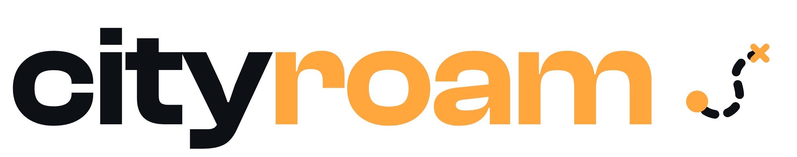
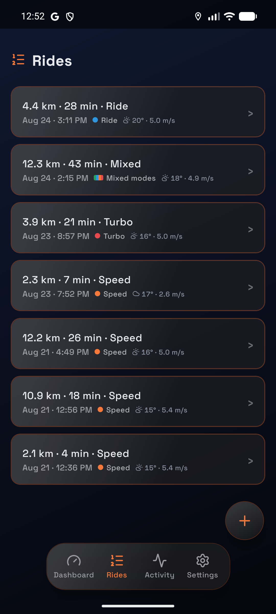
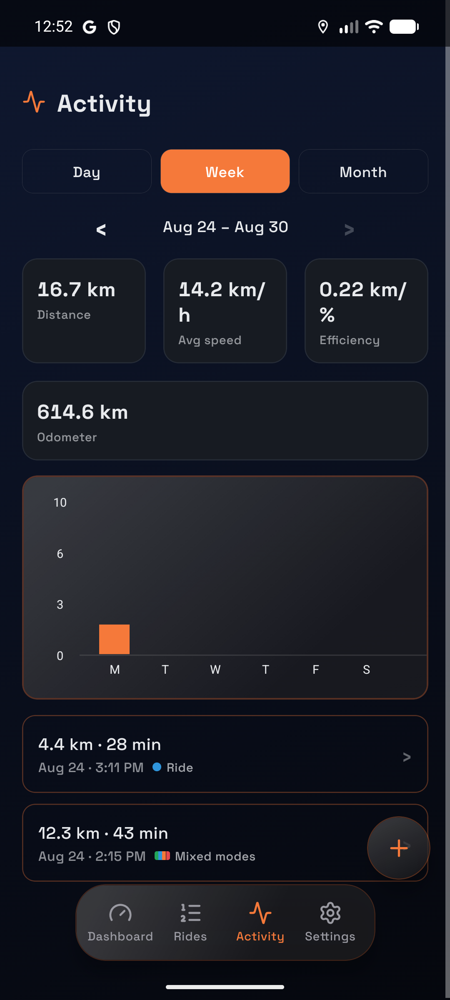
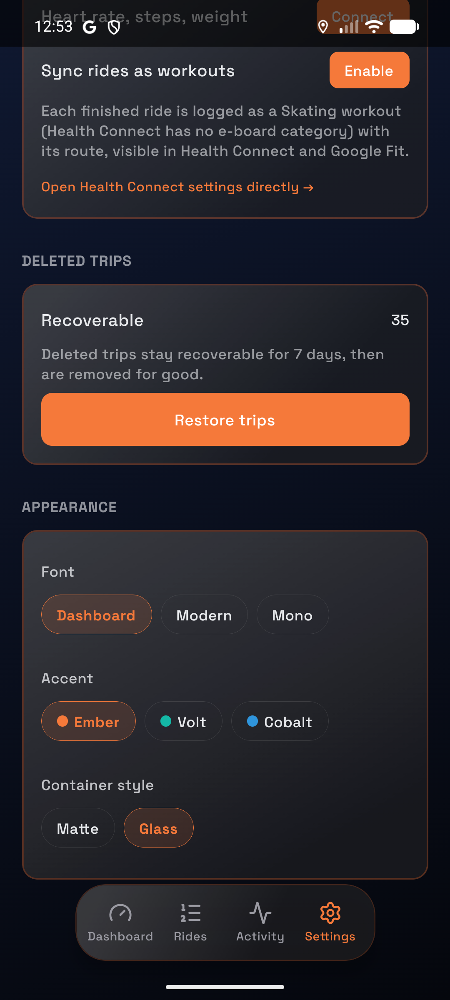
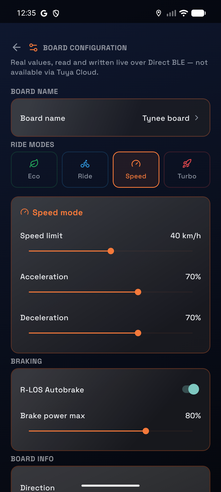

<picture>
  <source media="(prefers-color-scheme: dark)" srcset="docs/logo-dark.png">
  
</picture>

Cityroam is an Android app that records rides on Tynee electric skateboards and NAVEE
scooters. It talks to the board directly over Bluetooth for battery, voltage, odometer
and ride mode, records the route with the phone's GPS, and can change the board's own
settings. Finished rides sync to a server and, if you allow it, to Health Connect.

More detail is in [`docs/index.md`](docs/index.md).

## Status

- Android only.
- Boards: Tynee skateboards and NAVEE scooters that use the protocols this app speaks.
  NAVEE's V40i Pro is the model it was developed against. Other models are untested.
- Not on Google Play. Releases are APKs on the releases page, or build it yourself.
- The default server is the maintainer's and accounts on it are invite-only. Point the app
  at your own server to run it without one.

## Screenshots

<table>
  <tr>
    <td><br><sub>Rides</sub></td>
    <td><br><sub>Activity</sub></td>
  </tr>
  <tr>
    <td><br><sub>Settings</sub></td>
    <td><br><sub>Board settings</sub></td>
  </tr>
</table>

## Getting started

The app lives in [`mobile/`](mobile/). It uses native modules that Expo Go doesn't include,
so you need a development build on a device or emulator.

```bash
cd mobile
npm install
cp .env.example .env    # set EXPO_PUBLIC_DEFAULT_SERVER_ADDRESS
npm run android
```

The server is not part of this repository. See [`mobile/README.md`](mobile/README.md) for
setup, checks and the project layout.

## Contributing

Read [`CONTRIBUTING.md`](CONTRIBUTING.md) first. Contributions are by invitation.

Bug reports and feature requests are welcome through the issue forms. Anything security
related belongs in [`SECURITY.md`](SECURITY.md) rather than a public issue. Everyone
taking part is expected to follow the [`CODE_OF_CONDUCT.md`](CODE_OF_CONDUCT.md).

## Licence

The source is public so people can see how the app works. It is not open source.
Cityroam is licensed under the [PolyForm Strict License 1.0.0](LICENSE), which allows
personal, noncommercial use of the code as it is and nothing more: no changes, no
redistribution, no publishing your own build. For anything else, ask first.
Third-party dependencies keep their own licences.

## Contact

[@neowara](https://github.com/neowara) on GitHub, or [cityroamapp@casa-verde.casa](mailto:cityroamapp@casa-verde.casa).

Cityroam is not affiliated with any board manufacturer. See [`TRADEMARKS.md`](TRADEMARKS.md).
